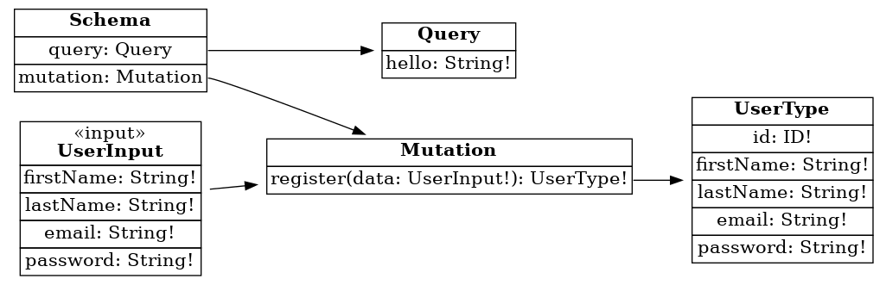

# TypeGraphQL CRUD Clean Arch example

This example demostrate implementation of a TypeGraphQL CRUD Clean Architecture example.

## Project structure

The architecture of the example is based on the clean architecture proposal so the project is separated into three parts.

1. The domain layer is the most internal and corresponds to the entities with which you can interact from the application layer, in it, they are defined at the model level and the attributes that compose it, currently there are the following domains: User \
   \
   If an outer layer, for example, an adapter, needs to use a specific domain, it must have the methods on its own that will allow transforming them for internal use, for example, the custom entities that are used by TypeORM, Apollo, and others

2. The application layer is where the interfaces implemented by the adapters are defined so that they have standard methods and can be used by dependency injection in the application use cases. On the other hand, the use cases implement their respective interface and are those that inject the adapter so that they can interact with the domain layer. Magic happens here. \
   \
   Currently, the existing interfaces, both for adapters and use cases, correspond to: HTTP and User.

3. The infrastructure layer is where everything outside the application meets, such as dependencies and tools that interact with the application, for example: Apollo and test (jest). \
   \
   On the other hand, in this layer, is where the adapters are, they implement standard interfaces where each implementation will depend on the library/dependency that is being used, for example: TypeORM.

## Coding style

The project code style are based on [Airbnb JavaScript Style Guide](https://github.com/airbnb/javascript).

## Installation

For installation the service you must run the following commands

- `cp .sample-env .env`: Command used to copy base for environment values.
- `make install`: Command used to install all require service dependencies.

## Typescript

The project has been developed using TypeScript, so there will always be a build process. It should be mentioned that the `ts-node-dev` interpreter is used for the development environment, so it is not necessary for the build process.

Only when the solution is packaged for production or staging is it necessary to transpile the project. But the `Makefile` file does it internally.

- `make typescript`: transpile the project and save everything in the` dist` folder

## Testing

To testing the application, following command must be run:

- `make test`: Command used to run all tests.
- `make test-dev`: Command used to run all tests with watching mode. `hint`: you can use regex pattern 👀

# Commands 🤖

## Development in local 💻

- `make dev`: command used to watch all files and debug if a typescript file is invalid. The command runs behind the docker-compose service and up all services, such as the database. \
  \
  _note_: check if `.env` values are correct for `local` environment.

## Other commands

In the `Makefile` you can see all the command, for example, `clean`, `stop`, `linter` or `check`.

# GraphQL

The project uses GraphQL to implement the service API, for this it uses the `Apollo library`.

## Model Diagram

Below is the diagram that refers to the infrastructure layer which is where the apollo dependency works:

